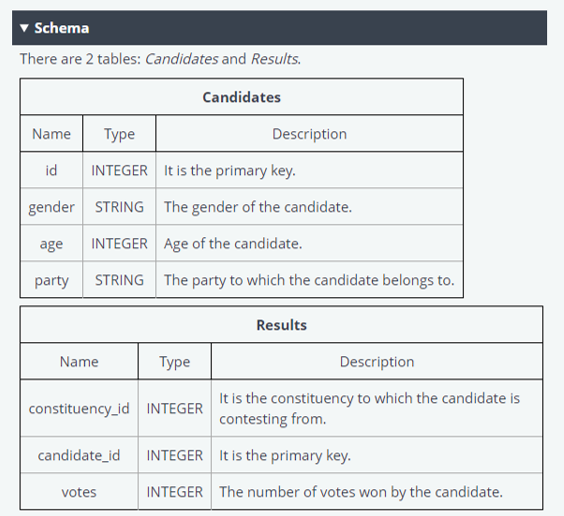
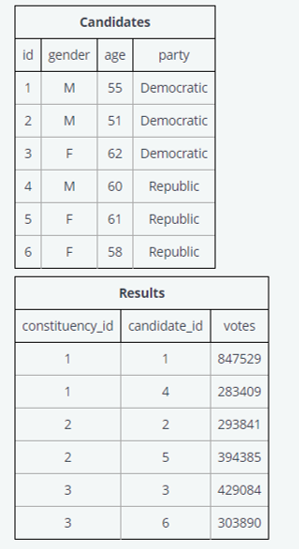
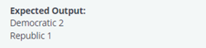
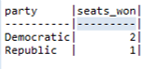
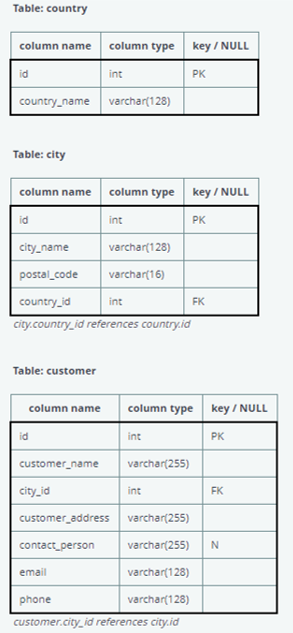
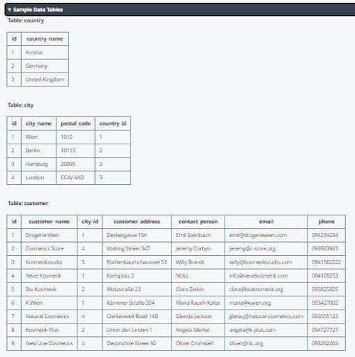
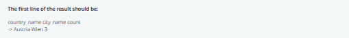
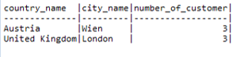

  
Holla! 👋

On October 17th 2020 I got a chance to compete in Telkomsel Tech Titan League - Data Analytics as 1 of selected 100 participants (from 700+ applicant).
Although I can not manage to secure up to 30th place, I still grateful to given a chance to join. We were given 10 questions, 2 of them are about SQL.

On this repo, I will share 2 sql questions from the competition and add my approach and query to solve the questions.

### Question 1: Election

 ```
 Given a database of the results of an election, find the number of seats won by each party. 
 There are some rules to going about this:
 - There are many constituencies in a state and many candidates who are contesting the election 
   from each constituency.
 - Each candidate belongs to a party
 - The candidate with the maximum number of votes in a given constituency wins for that constituency.
 
 The output should be in the following format: party | seats_won
 The ordering should be in the order of seats won in descending order.
 ```
The table schema, table value, and expected output given as follows:



The tables:





The result of my query to the case is as follow (you can check up my full query in the sql files):



### Question 2: Cities with More Customers Than Average

```
Write a query which will return all cities with more customers than the average number of customers 
of all cities. For each such city, return the country name, the city name and the number of customers. 
Order the result by country name ascending.
```

The table schema, table value, and expected output given as follows:



The tables:





The result of my query to the case is as follow (you can check up my full query in the sql files):


